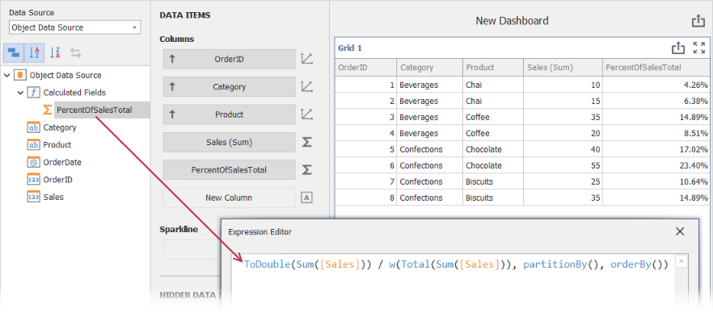

<!-- default badges list -->

<!-- default badges end -->
# Dashboard for WinForms - How to use Window Functions in Calculated Fields

Our dashboard has the built-in [Window Calculations](https://docs.devexpress.com/Dashboard/116917/common-features/advanced-analytics/window-calculations?p=netframework) functionality and you can use [predefined patterns](https://docs.devexpress.com/Dashboard/115920/common-features/advanced-analytics/window-calculations/creating-window-calculations) (including custom expressions) to define the *window calculation* for a certain [Measure](https://docs.devexpress.com/Dashboard/116523/basic-concepts-and-terminology/measures-and-dimensions?p=netframework) field.

However, there are certain usage scenarios when you wish to use some *window function* (see the corresponding subsection in the [Functions](https://docs.devexpress.com/Dashboard/400122/common-features/advanced-analytics/expression-constants-operators-and-functions#functions) help section) in the context of the [Calculated Field](https://docs.devexpress.com/Dashboard/116934/common-features/advanced-analytics/calculated-fields?p=netframework). For example, you may wish to perform complex calculation and combine several calculated fields. Since there is no way to include *window function* in the *calculated field* directly, the solution is to use the [w-Function](https://docs.devexpress.com/Dashboard/401421/common-features/advanced-analytics/aggregations/w-function-aggregation-intermediate-level?p=netframework).

This example illustrates how to emulate the standard [Percent of Total](https://docs.devexpress.com/Dashboard/115920/common-features/advanced-analytics/window-calculations/creating-window-calculations#percent-of-total) calculation behavior. For this the *calculated field* with the following expression is defined:

`ToDouble(Sum([Sales])) / w(Total(Sum([Sales])), partitionBy(), orderBy())`

The second part of this expression uses the *w-Function* with the embedded *window function* (`Total` in this example) to calculate the total Sales summary for the entire aggregated data collection. The current row summary is divided by this total to obtain the percentage. In addition, the *Percent* [formatting](https://docs.devexpress.com/Dashboard/15697/winforms-dashboard/winforms-designer/create-dashboards-in-the-winforms-designer/data-shaping/formatting-data) is applied.

<!-- default file list -->
*Files to look at*:

* [DesignerForm1.cs](./CS/DesignerForm1.cs)
* [dashboard1.xml](./CS/dashboard1.xml)
<!-- default file list end -->

## Documentation

- [Data Analysis](https://docs.devexpress.com/Dashboard/115868/winforms-dashboard/winforms-designer/create-dashboards-in-the-winforms-designer/data-analysis)
- [w Function - Window Calculations at the Intermediate Aggregation Level](https://docs.devexpress.com/Dashboard/401421/common-features/advanced-analytics/aggregations/w-function-aggregation-intermediate-level)

## More Examples

- [Dashboard for WinForms - How to Use the W Function to Show Top N Products by Category](https://github.com/DevExpress-Examples/winforms-dashboard-w-function-example)
- [Dashboard for WinForms - How to display best and worst monthly sales for each year](https://github.com/DevExpress-Examples/how-to-display-best-and-worst-monthly-sales-for-each-year-t369371)
- [Dashboard for WinForms - How to Calculate the Contribution of Quarterly Sales to Total Yearly Sales](https://github.com/DevExpress-Examples/how-to-calculate-the-contribution-of-quarterly-sales-to-total-yearly-sales)
- [Dashboard for WinForms - How to evaluate a customer acquisition using the quarter/year of their first purchase](https://github.com/DevExpress-Examples/how-to-divide-customers-count-by-the-number-of-orders-they-made-t372356)
- [Dashboard for WinForms - How to divide customers' count by the number of orders they made](https://github.com/DevExpress-Examples/how-to-divide-customers-count-by-the-number-of-orders-they-made-t372356)
- [Dashboard for WinForms - How to calculate Highest Product Sales by Year](https://github.com/DevExpress-Examples/how-to-show-products-with-the-best-sales-in-a-year-along-with-sales-values-t372408)
- [Dashboard for WinForms - How to display sales by years in comparison with the previous year's sales](https://github.com/DevExpress-Examples/win-dashboard-display-previous-year-sales)
- [Dashboard for WinForms - How to Display Product Sales that are Greater than $20k](https://github.com/DevExpress-Examples/How-to-Display-Product-Sales-that-are-Greater-than-20k)
- [Dashboard for WinForms - How to Display Products with Sales Greater than Average Sales per Category](https://github.com/DevExpress-Examples/How-to-Display-Product-with-Sales-Greater-than-Average-Sales-per-Category)
